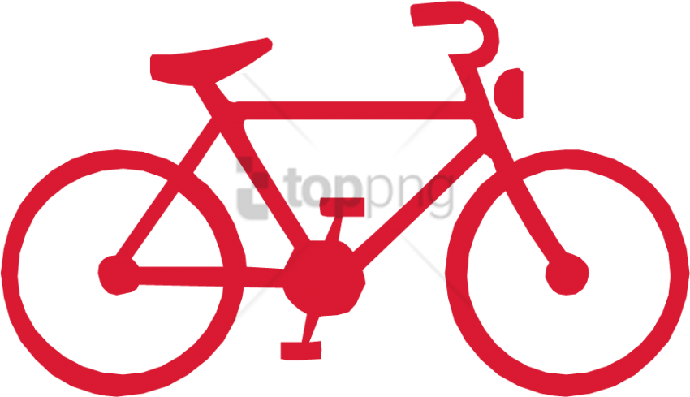

# **Bike Sharing Demand**

## Project Overview:
This project contains the dataset of the number of bikes rented in Seoul's bike sharing system and consist in the demand prediction conducted using three Models of Machine Learning (ML): Linear Regression, Random Forest and XGBoost were applied to four variations of the original dataset. Three Evaluation Metrics were evaluated R2 (Coefficient of Determination), MAE (Mean Absolute Error) and MSE (Mean Squared Error) This project explores the design, feature Engineering, Models, and Evaluation Metrics

**Objective**: 
Is predict a new outcome based on the trained prediction model in ML. 

# 📁 Table of Contents
 
1. [:computer: Data Collection](#data-collection)  
2. [:broom: Data Cleaning & Exploration](#data-cleaning--preprocessing)  
3. [:hammer_and_pick: Feature Engineering](#feature-engineering)  
4. [✨ Predictive Modeling](#predictive-modeling)  
5. [:white_check_mark: Model Performance](#presentation)  

---

# :computer: Data Collection
The raw data consisted of a datasets capturing rented bikes, weather and datetime data:

### `Dataset` (Seoul's bike sharing system)**
   - The original dataset was download from [datalab](https://www.datacamp.com/datalab/datasets/dataset-python-bike-sharing-demand)
   - **Duration**: December 01, 2017 – November 30, 2018
---

# :broom: Data Cleaning & Preprocessing

### 1. **Exploratory Data Analysis** 
   - Descriptive analysis from numerical and categorical features
   - Null Values
   - Duplicates
### 2. **Visualization**
   - Distribution Visualization
   - Outliers 
   - Scatter Plots 
   - Violin Plots for segment visualization

---

# :hammer_and_pick: Feature Engineering

| Dataset | Special Features |
|:----:|:-----:|
| df1 | One Hot Encoding for Holiday and Seasons |
| df2 | One Hot Encoding for Holiday and Seasons, Ciclycal Date |
| df3 | Rented Bike Count without outliers |
| df4 | One Hot Encoding for Holiday and Seasons, Ciclycal Date, Weather Condition |
---

# ✨ Predictive Modeling

### 1. **Three Models**
   - **Linear Regression**: raw and normalize
   - **Random Forest**: raw and normalize
   - **XGboost**: raw and normalize

### 2. **Hyperparameter Tuning**
   - ****  

### 3. **Evaluation Metrics**
   - **R2** (Coefficient of Determination)
   - **MAE** (Mean Absolute Error)
   - **MSE** (Mean Squared Error)

### 4. **Tech Stack** 

### **Data Manipulation**  
- **pandas**
- **numpy**   

### **Visualization** 
 - **matplotlib** 
 - **seaborn**
 
### **Models**  
- ****  
- ****
- ****
- ****
- ****
- **** 
- ****

---

# :white_check_mark: Model Performance

---

## The Presentation can be found in the next link: 